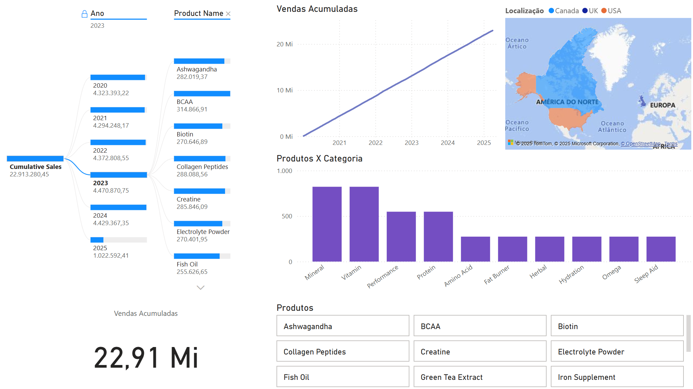
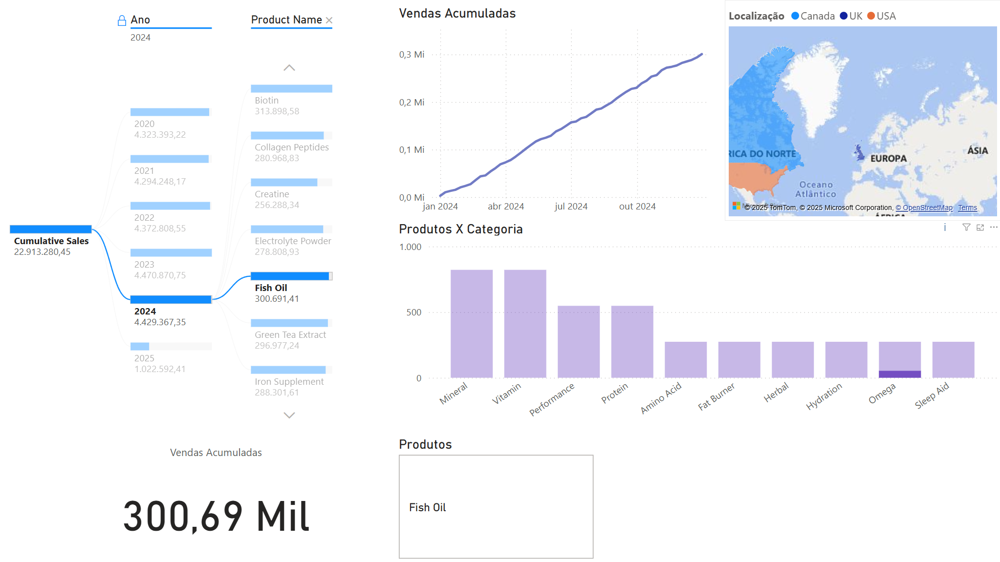
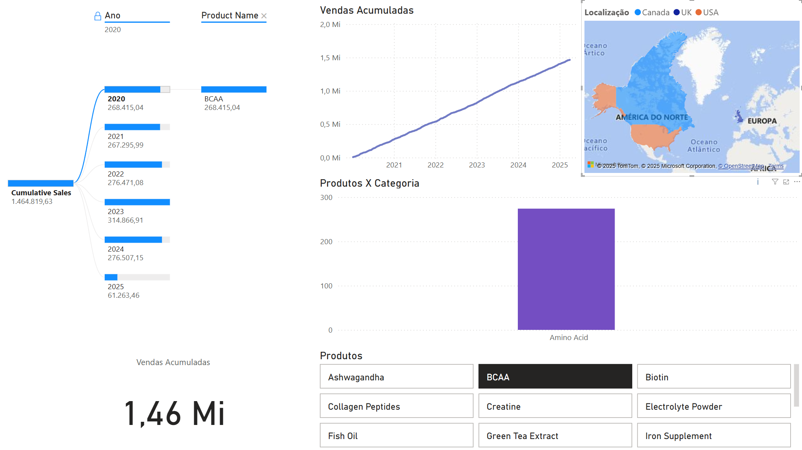

# 📊 Supplement Sales Analysis - Power BI Project

## 📚 Sobre o Projeto

Este projeto tem como objetivo analisar as vendas semanais de suplementos alimentares entre 2020 e 2025, utilizando o **Power BI** como ferramenta principal de visualização e análise de dados. A proposta é transformar dados brutos em **insights de negócio** que apoiem a tomada de decisões estratégicas.

O cenário simula o ambiente real de uma empresa do setor de **Health & Wellness**, abordando questões como tendências de vendas, impacto de descontos, retornos de produtos e desempenho por plataforma e região.

---

## 🛠️ Ferramentas e Tecnologias Utilizadas

- **Power BI Desktop**
- **DAX** (Data Analysis Expressions)
- **Excel** (Pré-processamento dos dados)
- **Git** e **GitHub** (Controle de versão)

---

## 🗂️ Descrição do Dataset

- **Período:** Janeiro/2020 até Abril/2025
- **Frequência:** Semanal (todas as segundas-feiras)
- **Número de Registros:** 4.384 linhas
- **Colunas:**
  - `Date`: Semana da venda
  - `Product Name`: Nome do suplemento
  - `Category`: Categoria do suplemento (Protein, Vitamin, Omega, etc.)
  - `Units Sold`: Número de unidades vendidas
  - `Price`: Preço do produto
  - `Revenue`: Receita total gerada
  - `Discount`: Desconto aplicado (%)
  - `Units Returned`: Número de unidades devolvidas
  - `Location`: Localização da venda (USA, UK ou Canadá)
  - `Platform`: Plataforma de venda (Amazon, Walmart, iHerb)

---

## 📈 Análises Realizadas

- **Tendência de Vendas ao Longo do Tempo**  
  Análise da receita semanal total utilizando gráficos de linha.

- **Receita Cumulativa**  
  Cálculo do crescimento acumulado das vendas ao longo do tempo utilizando DAX.

- **Produtos com Maior e Menor Receita**  
  Ranking dos suplementos mais e menos rentáveis.

  - **Seleção por Ano e Nome do Produto**  
  Análise de Vendas dos produtos por Ano

---

## 🧮 Dashboard na Prática
- **Dashboard Principal**

  

---
- **Maior venda de 2024**

  

---
- **Filtro por Produto Específico**

  

---

## 📬 Contato

Enzo Koyano Pedriça - [LinkedIn](https://www.linkedin.com/in/enzo-koyano-pedriça/)

